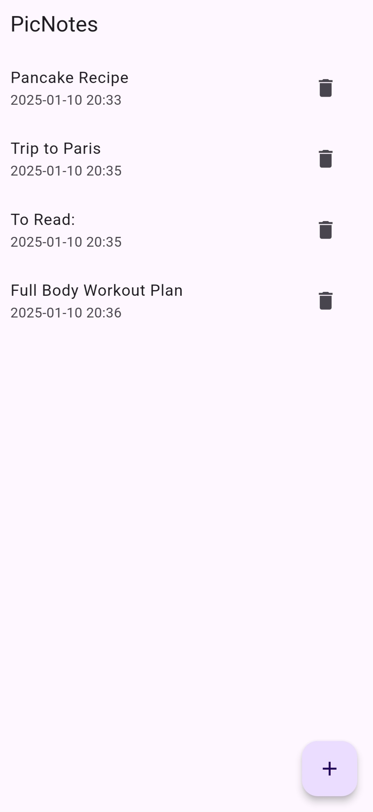

# PicNotes

## Project Overview

PicNotes a cross-platform mobile application built with Flutter that allows users to write notes and attach photos.

||||
|-|-|-|
||||

## Features
- Create and manage notes
- Add images to notes
- View added images in full-screen
- Delete images from the note gallery individually

## Dependencies

### Project Dependencies
- `flutter`: SDK for building the application.
- `provider`: State management package.
- `shared_preferences`: Local storage for persisting notes and data.
- `image_picker`: For selecting images from the device gallery.
- `uuid`: For generating unique identifiers for notes.

### Development Dependencies
- `flutter_launcher_icons`: For customizing the app icon.
- `flutter_test`: For testing the app.
- `flutter_lints`: For enforcing code standards and best practices.

## **How to Run the Project**

To run this project on your local machine, follow the steps below:

#### **Environment Setup**

1. **Install Flutter SDK**  
   First, you need to have Flutter installed on your machine. If you haven't installed Flutter yet, follow the official installation guide:
   - [Flutter installation for Windows](https://flutter.dev/docs/get-started/install/windows)
   - [Flutter installation for macOS](https://flutter.dev/docs/get-started/install/macos)
   - [Flutter installation for Linux](https://flutter.dev/docs/get-started/install/linux)

2. **Install Android Studio**  
   You need Android Studio to run and build the app for Android devices. If you haven't installed Android Studio, download and install it from the official website:
   - [Download Android Studio](https://developer.android.com/studio)

   After installing Android Studio, make sure to install the Flutter and Dart plugins within Android Studio:
   - Go to **Preferences** (or **Settings** on Windows/Linux) > **Plugins** > Search for **Flutter** and **Dart** and install both.

3. **Setup an Emulator**  
   - Open Android Studio, navigate to **Tools > AVD Manager**, and set up a new virtual device.

4. **Install Dependencies**  
   Once you have Flutter and Android Studio set up, you need to install the project dependencies. Open a terminal/command prompt and navigate to the project folder, then run the following command to install the necessary dependencies:
   
   ```
   flutter pub get
   ```


#### **Running the Project**

- **Run the App on an Emulator or Device**  
   With the dependencies installed, you can now run the app on either an emulator or a connected device. Run the following command in your terminal:

   ```
   flutter run
   ```

   This will launch the app on your default device/emulator. If you have multiple devices connected, you can specify a target device by using:

   ```
   flutter run -d <device-id>
   ```

   You can list available devices by running:

   ```
   flutter devices
   ```
